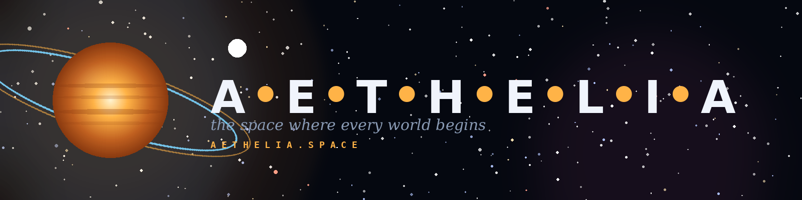

# AETHELIA

<p align="center">
  
</p>

<p align="center">
  <i>The space where every world begins.</i><br>
  <a href="https://aethelia.space">aethelia.space</a>
</p>

---

An interactive 3D multi-system space simulator. Explore real star systems like our own Solar System, Alpha Centauri, and TRAPPIST-1; warp to famous cosmic anomalies such as Sagittarius A\*, M87\*, TON 618, the Crab Pulsar, and Sirius B; or design entirely new worlds with custom composition, atmosphere, and orbital parameters.

## Features

- **Six real star systems** with accurate orbital and physical data — Sol, Alpha Centauri, Sirius, TRAPPIST-1, Barnard's Star, Kepler-442
- **Twelve real cosmic anomalies** rendered with GLSL shaders — supermassive black holes, quasars, pulsars, neutron stars, white dwarfs, wormhole
- **Procedural planet textures** — terrestrial worlds with oceans, continents, ice caps, clouds; gas giants with turbulent bands and storms
- **Shader-based anomaly visuals** — gravitational lensing, Doppler-beamed accretion disks, relativistic jets, pulsar beams
- **Custom planet designer** — build your own world with water / land / ice / atmosphere composition, rings, color palette
- **Warp navigation** between systems and anomalies
- **Pure single-file app** — no build step required

## Tech Stack

- Three.js `0.160.0` (via CDN importmap)
- Vanilla JavaScript, HTML, CSS — no framework, no bundler
- GLSL fragment shaders for anomaly rendering
- Procedural noise (value noise + FBM) for planet/star textures

## Local Development

This is a single static HTML file. You can open it directly, but browsers restrict module imports from `file://`, so serve it locally:

```bash
# Python 3
python3 -m http.server 8000

# Or with Node
npx serve .
```

Then visit `http://localhost:8000`.

## Deployment

### Option 1 — Cloudflare Pages (recommended)

1. Push this repo to GitHub (see below).
2. Log in to [Cloudflare Pages](https://pages.cloudflare.com).
3. Create project → connect GitHub → select this repo.
4. Build settings: **Framework preset: None**, **Build command: empty**, **Build output directory: `/`**.
5. In **Custom domains**, add `aethelia.space`. Cloudflare will give you nameservers — point your registrar there, or add the provided CNAME.

### Option 2 — Netlify

1. Push to GitHub.
2. On [Netlify](https://netlify.com) → Add new site → Import from Git → select repo.
3. Build command empty, publish directory `/`.
4. Domain settings → Add custom domain → `aethelia.space` → follow DNS instructions.

### Option 3 — Vercel

```bash
npm install -g vercel
vercel --prod
# then link aethelia.space in the dashboard under Settings → Domains
```

### Option 4 — GitHub Pages

Settings → Pages → Source: `main` branch, root folder. Then point `aethelia.space` to `<user>.github.io` via CNAME and add a `CNAME` file with `aethelia.space`.

## Pushing to Git

```bash
git init
git add .
git commit -m "Initial commit — Aethelia launch"
git branch -M main
git remote add origin git@github.com:<your-username>/aethelia.git
git push -u origin main
```

## Project Structure

```
aethelia/
├── index.html              # The entire app (single file)
├── manifest.json           # PWA manifest
├── robots.txt
├── sitemap.xml
├── LICENSE                 # MIT
├── README.md
├── .gitignore
└── assets/
    ├── favicon.ico
    ├── favicon-16.png
    ├── favicon-32.png
    ├── icon-192.png
    ├── icon-512.png
    ├── apple-touch-icon.png
    ├── logo-compact.png    # 1600×400 — site header
    ├── logo-wide.png       # 2400×900 — hero banner
    ├── logo-square.png     # 1200×1200 — social / OG
    └── og-image.png        # Copy of square for OG tag
```

## Brand

- **Dark background:** `#050810`
- **Primary text:** `#f0f4fc`
- **Dim text:** `#8a9bb5`
- **Amber accent (dots, rings):** `#ffb347`
- **Blue accent:** `#7cd5ff`
- **Magenta accent:** `#ff5577`
- **Fonts:** Syncopate Bold (display), Instrument Serif Italic (tagline), JetBrains Mono (UI)

## License

MIT — see [LICENSE](LICENSE).

---

Built with Three.js and a lot of astronomical curiosity.
